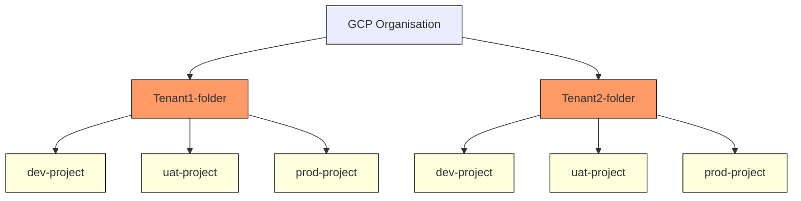

# Terraform Google Cloud Modules

These modules make it easy to manage [Google Cloud](https://cloud.google.com) resources using [Terraform](https://www.terraform.io).

> The presented solutions are intended for learning purposes. Hence, don't treat as production-ready.

## Compatibility

> See Terraform documentation on [Getting Started with the Google Provider](https://registry.terraform.io/providers/hashicorp/google/latest/docs/guides/getting_started).

The modules were tested using [Terraform v1.1.7](https://www.terraform.io/downloads) with [Terraform Google Provider v4.13.0](https://registry.terraform.io/providers/hashicorp/google/latest) on `MacOs Monterey 12.2.1`.

```hcl
terraform {
  required_version = "~> 1.1.7"
  required_providers {
    google = {
      source  = "hashicorp/google"
      version = "4.13.0"
    }
  }
}
```

### Service Account

Service account or user credentials with the following role(s) must be used to provision the resources of this module:

- Storage Admin: `roles/storage.admin`

## GCS buckets and roles

### Problem Statement

This module tries to address an issue where you have a [multi-tenant](https://cloud.google.com/architecture/designing-multi-tenant-architectures) environment on `GCP` and want to use `Infrastructure-as-Code (IaC)` to manage the resources created in different projects and environments - *dev/uat/prod*.

Requirements:

- Both the *IT team* and *tenants* must execute the `IaC` whenever necessary.
- *Tenants* must not be required to know `terraform` or `GCP` nomenclature.
- Each tenant has its own GitHub repository and from it you need to manage all the resources.
- Use [GCP Predefined roles](https://cloud.google.com/storage/docs/access-control/iam-roles#standard-roles)
- Create multiple buckets in [multiple locations](https://cloud.google.com/about/locations)
- Tenants can assign permission to [GCP service accounts](https://cloud.google.com/iam/docs/service-accounts) that belong to different projects, i.e. *tenant1* can assign `viewer` permission to a *tenant2* service account.

Architecture example:



> Flowchart created using [Mermaid](https://mermaid-js.github.io/mermaid/#/)

### Proposed Solution

- [GCS buckets and roles](./terraform-google-cloud-storage)
